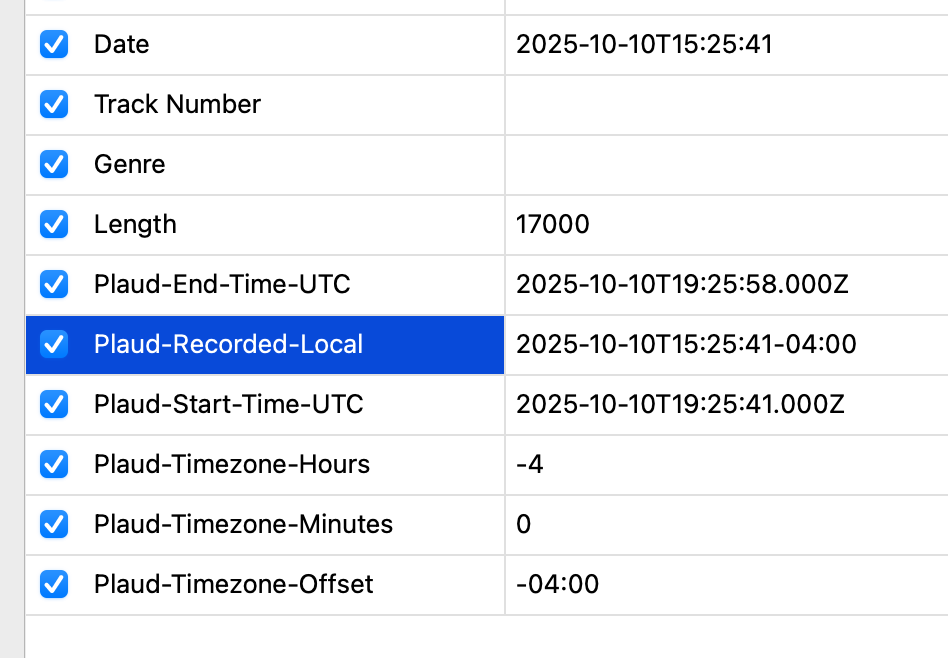

# Plaud Metadata Tags

When you enable **Include metadata tags** in the popup, the extension embeds a small set of ID3v2.3 text frames into each downloaded MP3. These tags capture start/end timestamps and timezone context from Plaud so that local media managers can display or sort recordings chronologically.

All tags are added as UTF-16 encoded text and are omitted if the source metadata is missing.

## Standard Frames

- `TDRC` – Recording date/time in local time (e.g., `2025-10-10T15:25:41`). This is derived from Plaud’s start time plus the timezone offset.
- `TLEN` – Recording length in milliseconds (e.g., `17000` for a 17 second recording).

## Custom `TXXX` Frames

Each custom frame uses the `TXXX` (User defined text) ID with a descriptive label so other tools can access the data.

- `Plaud-Recorded-Local` – Start time with offset, such as `2025-10-10T15:25:41-04:00`.
- `Plaud-Start-Time-UTC` – UTC ISO timestamp of the recording start (e.g., `2025-10-10T19:25:41.000Z`).
- `Plaud-End-Time-UTC` – UTC ISO timestamp of the recording end (e.g., `2025-10-10T19:25:58.000Z`), only when Plaud provides an end time.
- `Plaud-Timezone-Offset` – Human-readable offset in `±HH:MM` form (e.g., `-04:00`).
- `Plaud-Timezone-Hours` – Signed hour component of the offset (`-4` in the example above).
- `Plaud-Timezone-Minutes` – Minute component of the offset (`0` for whole-hour offsets). Plaud currently reports minutes for non-hour boundaries; if they are unavailable the frame is omitted.

## Notes

- Tags only apply to MP3 downloads. WAV, OGG, or other formats are passed through unchanged.
- Plaud occasionally omits timezone data; when that happens, only the frames that can be derived from available information are written.
- You can inspect the tags on macOS with `ffprobe -show_entries format_tags -of json <file.mp3>` or any ID3 tag editor.

