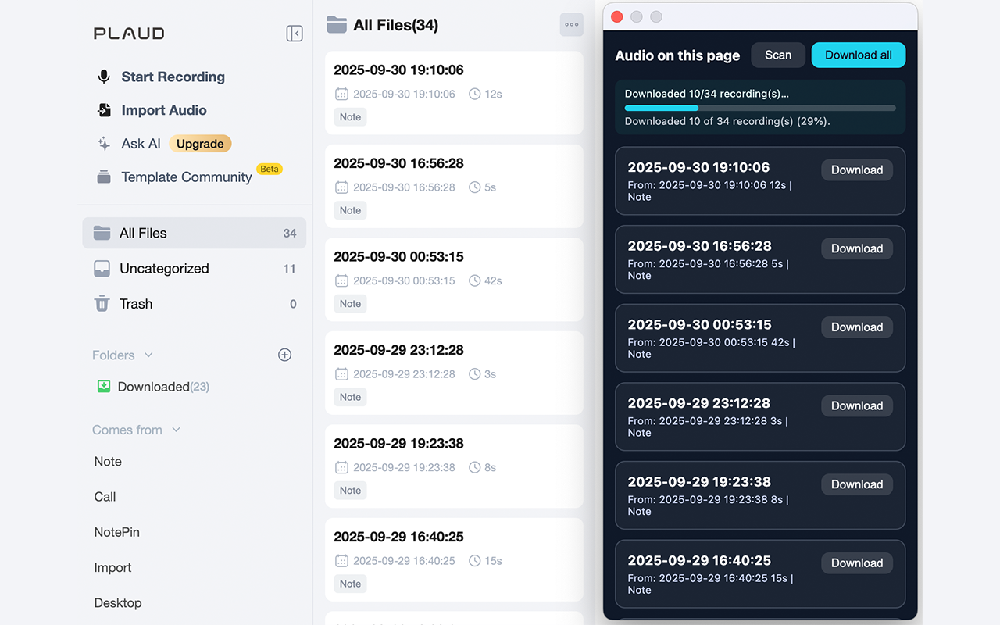
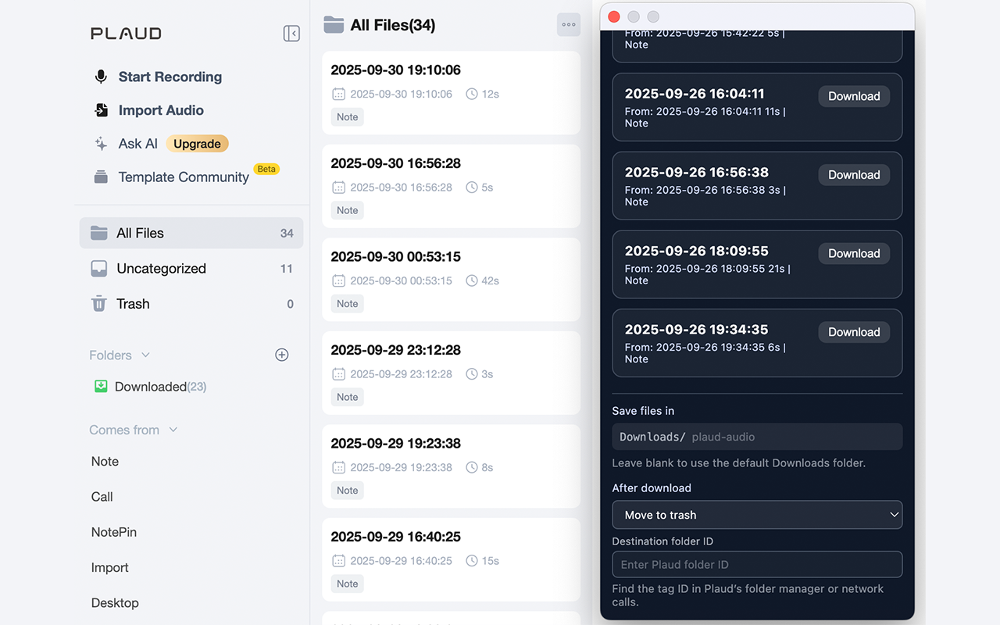

# Plaud Recording Downloader

An open-source Chrome extension that helps you scan your Plaud dashboard, queue multiple recordings, and download the audio in the background with one click.

## Why you might want it

- Bulk-scan any Plaud recordings list and queue everything (or pick single items)
- See live progress in the popup and on the toolbar badge while downloads run
- Automatically generate safe filenames and subfolders inside your Downloads directory
- Optional post-download cleanup: move recordings into a Plaud folder or send them to trash
- Stop an in-progress batch instantly if you change your mind

## Install

- **Chrome Web Store**: _Coming soon, currently pending review_
- **Manual ZIP**: Download the latest release from the [Releases](https://github.com/iiAtlas/plaud-recording-downloader/releases) page and load it via `chrome://extensions` → Developer mode → **Load unpacked** (select the extracted `extension/` folder).
- **Build**: Clone the repo, `npm run build`, and load unpacked in Chrome.

## Using the popup

1. Click **Scan** to collect recordings from the current Plaud view.
2. Adjust settings (optional folder, post-download action) in the lower section.
3. Use **Download all** (or the per-item buttons) to queue audio. The button switches to **Stop** while a background job is active.
4. Keep the Plaud tab open; downloads continue even if you close the popup.
5. Watch progress in the popup and toolbar badge. You can cancel at any time with **Stop**.

## FAQ

**Do I need to refresh Plaud after installing?**  
Yes. The content script loads when Plaud first opens. If you add the extension while Plaud is already open, refresh the tab before scanning.

**Where do files save?**  
By default, Chrome uses your regular Downloads folder. Set a subfolder in the popup (e.g., `plaud-audio`) if you want the files grouped.

**Does this extension send my recordings anywhere else?**  
No. All processing happens locally. The extension only speaks to Plaud on your behalf. See the [privacy policy](PRIVACY.md) for details.

**Can I stop a running batch?**  
Yes. While downloads are running, **Download all** turns into a red **Stop** button. Click it to cancel the queue and remaining browser downloads.

**Why does the popup sometimes ask me to open Plaud?**  
The extension only works on `https://app.plaud.ai`. Make sure the active tab is on that domain and you’re signed in.

**Where do I find the Plaud folder (tag) ID?**  
Open Plaud’s folder manager, select the destination folder, and copy the `tagId` from the URL or the network panel (look for `tagInfo` requests). Paste that value into the popup’s **Destination folder ID** field when using the move action.

## Resources

- [Getting involved (CONTRIBUTING.md)](CONTRIBUTING.md)
- [Privacy policy (PRIVACY.md)](PRIVACY.md)
- [Changelog (CHANGELOG.md)](CHANGELOG.md)
- [MIT License (LICENSE.md)](LICENSE.md)
- [Issue tracker](https://github.com/atlas/plaud-recording-downloader/issues)

Plaud Recording Downloader is free and open source. Contributions are welcome!
